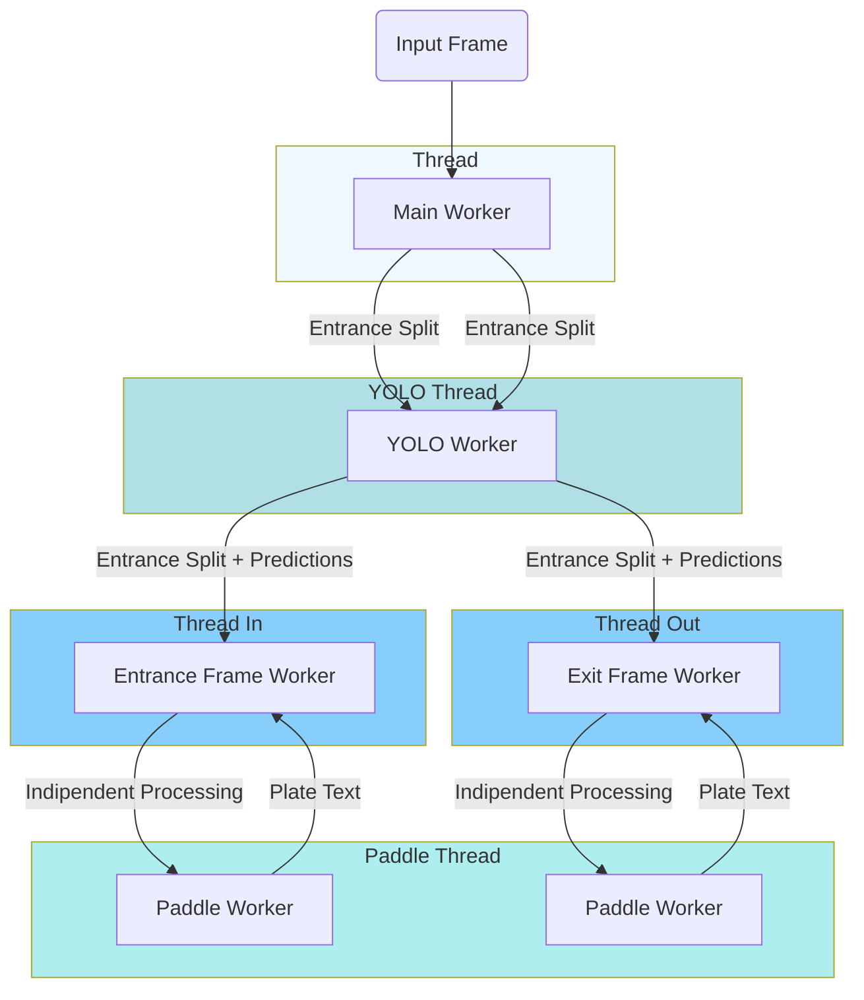
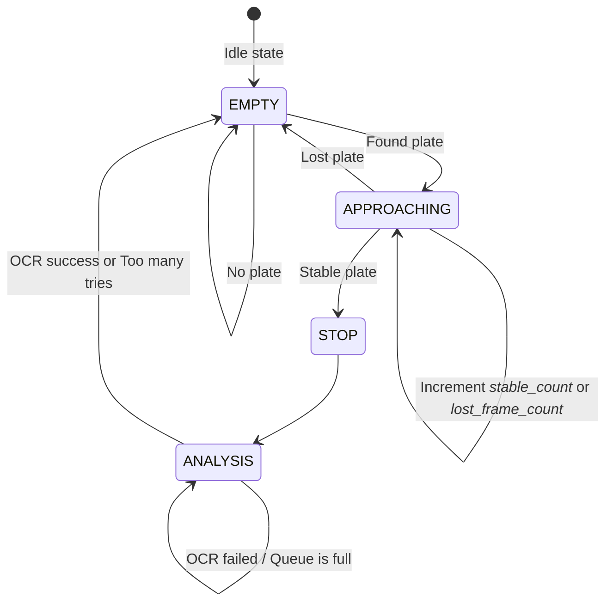

<div align="center">

<h1>ParkNet</h1>
<h3>Your all in one solution for parking management</h3>

<p>
  <a href="https://www.linkedin.com/in/matteo--bergamaschi/">Matteo Bergamaschi</a>,
  <a href="https://www.linkedin.com/in/francesco-della-casa/">Francesco Della Casa</a>,
</p>

</div>

## Table of content 
- [Abstract](#abstract)
- [Computer Vision](#computer-vision)
  - [Multi-thread Pipeline](#multi-thread-pipeline)
- [FastAPI](#fastapi)
- [IOT](#iot)
- [KMP Application](#kmp-application)
- [Setup](#setup)
    - [Enviroment](#enviroment)
    - [Arduino](#arduino)
    - [Run](#run)
    - [Database](#database)
    - [FastAPI](#fastapi-1)


# Abstract

**ParkNet** is a self-managing parking ecosystem designed to tackle the everyday pain points of urban parking: wasted time, increased traffic and emissions, zero visibility on available spots, and the frequent abuse of accessible parking. 

By turning these pain points into system requirements, ParkNet introduces an intelligent IoT network that fuses computer vision, hardware automation, and a mobile application to fully manage entry, exit, and spot availability with zero human intervention required. 

The system relies on four core pillars:
1. **Automated License Plate Recognition:** Instantly identifying vehicles at the gates.
2. **Automated Access:** A microcontroller-powered barrier that opens seamlessly.
3. **Mobile App:** Allowing users to find and lock in their spots before hitting the road.
4. **Predictive Analytics:** AI-driven occupancy forecasts and automated reporting.


# Computer Vision

The vision system acts as the eyes of ParkNet. It utilizes a combination of **YOLO** (specifically YOLOv11 for high-accuracy license plate detection), **PaddleOCR** for text extraction, and **OpenCV** for frame processing. 

To ensure the system remains highly responsive and reliable, it employs a state machine (Idle → Vehicle Detected → Stable Frame → OCR Running → Plate Confirmed) combined with smart queue saturation control to prevent frame backlogs.

## Multi-thread Pipeline

To handle the heavy lifting of real-time video processing without dropping frames, the architecture leverages a highly concurrent multi-threaded pipeline:



In particular each **frame worker** implements a FSM to achieve reliable performance while capturing the plate on the car.


# FastAPI
The FastAPI backend serves as the central brain of the ParkNet ecosystem. It orchestrates the business logic, handles data persistence, and bridges the gap between the mobile application and the physical IoT hardware.

Key Responsibilities & Stack:

* **REST API**: Provides secure HTTPS endpoints for the mobile application to query spot availability, register vehicles, and process checkout/payments.
* **Database Management**: Utilizes SQLAlchemy and SQLite to maintain a robust data model consisting of User, Vehicle, ParkingSlot, and ParkingLog tables.
* **Smart Logic**: Dynamically fetches lot capacities (standard vs. accessible spaces) from the database, ensuring ultimate configuration flexibility and segregated capacity tracking.
* **Data & Analytics**: Mines historical occupancy trends using the ParkingLog. It integrates with Prophet AI models for dedicated forecasting, feeding interactive data to a Streamlit and Plotly dashboard, and generating automated HTML weekly executive reports.

# IOT
ParkNet bridges the digital and physical worlds through a lightweight, highly responsive messaging ballet.

The Hardware & Comm Stack:
* **Mosquitto (MQTT)**: The central message broker routing events across the ecosystem.
* **Python Serial Bridge**: A dedicated script translating digital commands into physical actions.
* **Arduino & Servo Motors**: The physical gear receiving commands to actuate the gate.

The Execution Flow (Gate Opening):
* **Detection**: The Camera Pipeline stabilizes the frame and successfully reads the plate.
* **Publish**: The pipeline publishes a Plate Confirmed event to the MQTT Broker.
* **Verify**: The FastAPI backend catches the event, validates the plate against the database, and tracks the entry/exit.
* **Command**: The backend issues an Open Command back to the MQTT Broker.
* **Actuate**: The Python Bridge picks up the command, translates it into raw serial instructions (pyserial), and prompts the Arduino to operate the barrier smoothly.

# KMP Application
The user-facing component is built using Kotlin Multiplatform (KMP), offering a seamless, native experience for users to interact with the parking ecosystem.

The Seamless User Journey:
* **Spot Search**: Before even driving, users can launch the app and instantly check real-time availability via an interactive map or list view.
* **Accessible Parking**: Users can easily locate and verify the availability of dedicated accessible parking spots.
* **Entry Confirmation**: Once the IoT system recognizes the vehicle at the gate, the app reflects the active parking session.
* **Frictionless Checkout**: When ready to leave, the user signals their departure via the app. The system auto-calculates the fare based on the precise duration logged in the backend.
* **Exit**: Upon successful in-app payment, the backend communicates with the IoT gate, lifting the barrier automatically for a smooth drive away.

# Setup

### Enviroment
* Create and set the enviroment:
```bash
python3.11 -m venv .venv
source .venv/bin/activate
```
* Install the requirements:
```bash
pip install -r requirements.txt
```

### Arduino
* Load the arduino code (*~/Arduino/iot_parking_servo.ino*) inside the board ([Arduino IDE](https://support.arduino.cc/hc/en-us/articles/360019833020-Download-and-install-Arduino-IDE))
* To test just the arduino you can use the command **o1** and **o2** on the serial monitor of arduino ide that will open the gates

### Run
* Set the correct camera input index and IOT device
* Launch the program with the script **launcher.py** that will create 4 processes: 
    * Computer Vision
    * FastAPI Server
    * Arduino Bridge
    * Mosquitto
```bash
python3 launcher.py
```

### Database
To easly manage the database interaction use **manage.py** with one of the following commands option: 
* **"admin-create"**:    cmd_create_admin,
* **"admin-delete"**:    cmd_delete_admin,
* **"parkings-init"**:   cmd_init_parkings,
* **"history-init"**:    cmd_init_history,
* **"users-create"**:    cmd_create_users,
* **"users-delete"**:    cmd_delete_users,
* **"cars-delete"**:     cmd_delete_cars,
* **"bookings-create"**: cmd_create_bookings,
* **"bookings-delete"**: cmd_delete_bookings,
* **"session-create"**:  cmd_create_session,
* **"session-delete"**:  cmd_delete_session,
* **"init-database"**:   cmd_init_database, 

To init the database with a default configuration use this command after launching **launcher.py**:
```bash
python3 manage.py init-database
```

### FastAPI
To easly see and test all the available API calls that the FastAPI server supports, you could use the *swaggerUI* that could be red at [localhost:8000/docs](localhost:8000/docs).