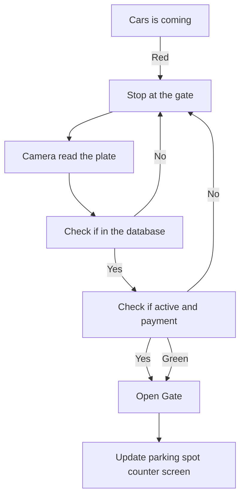
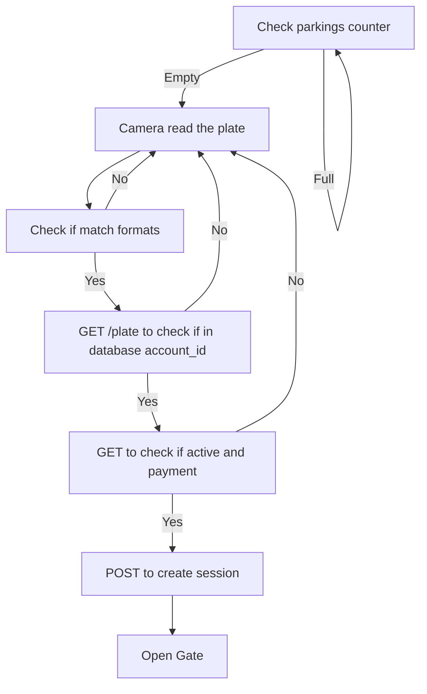
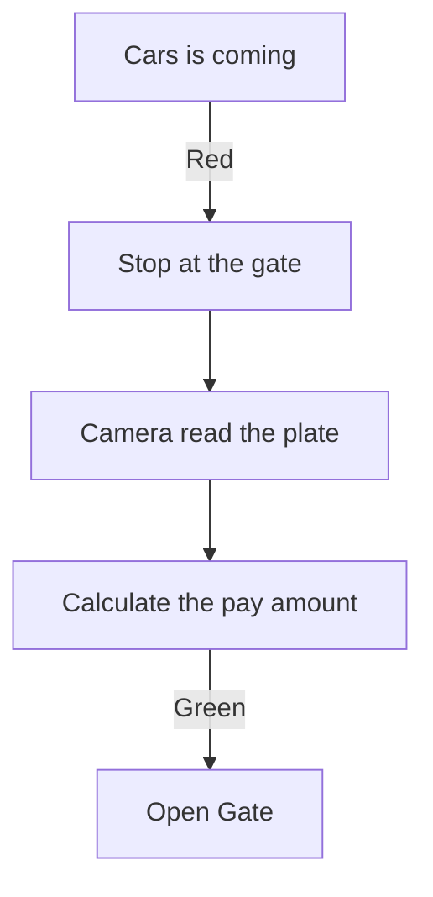
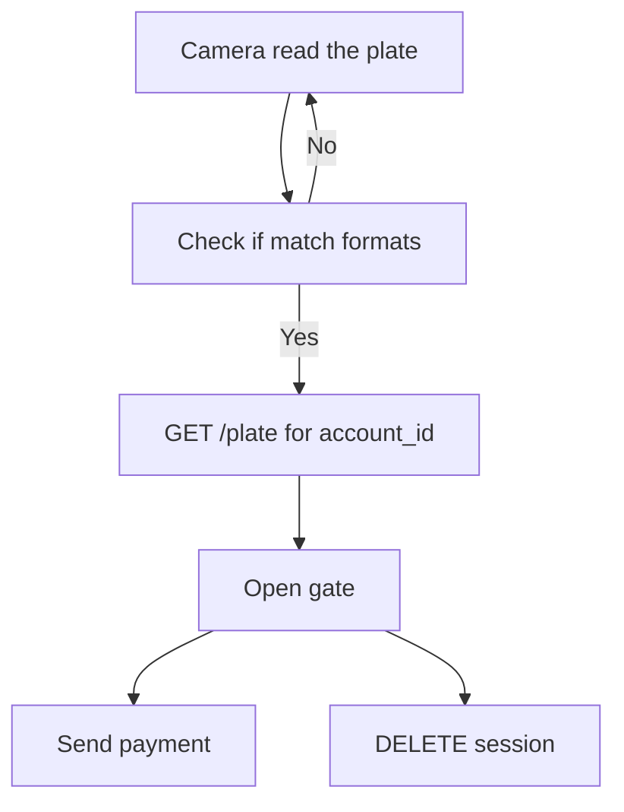

# Project Structure


# Enviroment
* Create and set the enviroment:
```bash
python3 -m venv .venv
source .venv/bin/activate
```
* Install the requirements:
```bash
pip install -r requirements.txt
```

### Entering





### Exiting





# Todo 
* MQTT handler (split gate backend and MQTT)
* Handle search of correct usb port for arduino
* Model time series 
* Model correct plate's format
* Clean up OCR file from unnecessary slop
* Create the scale model
* Understand the dimension of scale model in relation to dimension of plate
* Create a single script to handle all the startup terminals
* Split the webcam input entering/exiting